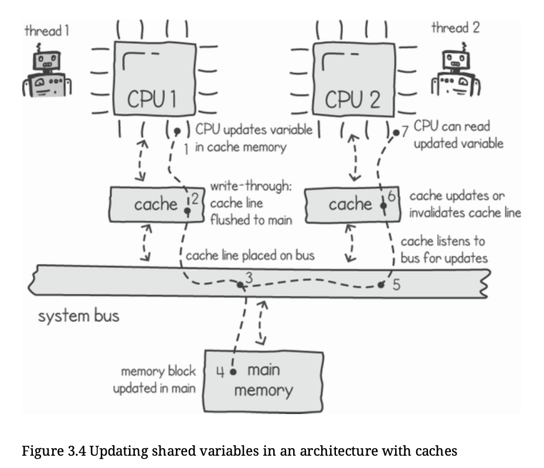

# Inter-Thread Communication

Inter-thread communication can be broadly classified into two main models:
1. Memory Sharing
2. Message Passing

1. **Memory Sharing**

- A common block of memory is shared among multiple threads.
- All threads can read from and write to this shared memory concurrently.
- Threads communicate by mutating shared state (variables, data structures, etc.).

*Pros:*

- Fast (no copying of data).
- Efficient for large data structures.

*Cons:*

- Requires careful synchronization (locks, atomics, memory barriers).
- Prone to race conditions, deadlocks, and visibility issues.
- Becomes especially tricky on multi-processor systems due to cache behavior.

2. **Message Passing**

- Threads communicate by sending messages to each other.
- Shared mutable memory is avoided or minimized.
- Communication happens via well-defined channels or queues.

Example: In Go, message passing is implemented using channels.

*Pros:*

- Easier to reason about correctness.
- Avoids many shared-memory pitfalls.
- Naturally enforces synchronization.

*Cons:*

- Overhead of message copying and scheduling.
- May be less efficient for very high-throughput shared data access.

**Commonly Used Approach:**

- Memory sharing is the most commonly used technique in low-level systems and performance-critical code.
- However, it introduces several complexities on multi-processor architectures, one of the most important being cache coherency.

**Cache Coherency**

- Modern processors sit behind multiple levels of cache (L1, L2, L3) to reduce memory access latency.
- In a multi-core system:
  - Each core may have its own cached copy of the same memory location.
  - If one processor updates a variable, other processors must see that update.
  - Failing to do this leads to stale reads and incorrect program behavior.

**Cache Coherency Techniques**

1. Cache Write-Through (with Invalidation or Update)

- When a processor updates a variable:
    - The update is immediately written to main memory.
    - Other processors are notified.
- Other caches may:
    - Update their cached value (replication), or
    - Invalidate their cached copy.

📌 Ensures strong consistency but can be slow due to frequent memory writes.

2. Cache Invalidation

- When a processor modifies a memory location:
    - All other processors that cache that memory address are notified.
    -Their cached copy is invalidated (flushed).
- On the next read:
    - The processor fetches the updated value from main memory.

📌 This is the most commonly used approach in modern CPUs.