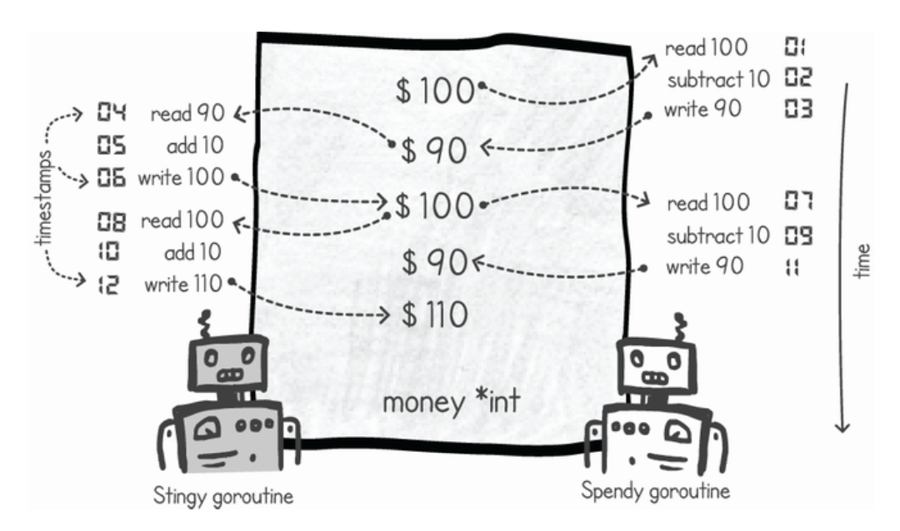

# Race Condition in ITC by memory-sharing

**Critical Section:** A critical section in our code is a set of instructions that should be executed without interference from other executions affecting the state used in that section. When this interference is allowed to happen, race conditions may arise.

**Race Condition:** A race condition occurs when two or more goroutines access the same memory location concurrently, at least one access is a write, and there is no synchronization.

*Example:*
```
var count int

func main() {
    for i := 0; i < 1000; i++ {
        go func() {
            count++
        }()
    }
    time.Sleep(time.Second)
    fmt.Println(count)
}
```

Expected : 1000 but in reality it gives different output everytime you run it.

**Reason?** 
- count++ is not atomic
- It expands to:
    - load count
    - add 1
    - store count
- Interleaving breaks correctness



- In above, both go routine are trying to update a single var without sync, the count++ op is broken into 3 parts as explained above and you might notice that everything was going well until timestamp 7 & 8 when both go-routine loads the same value.


**Why Single-Core Often “Hides” Bugs ?**
- Same CPU, Same registers, Same cache, No cache coherence delay
- So this works accidentally:
```
var done bool

go func() {
    done = true
}()

for !done {
}
```

- Single-core systems reduce memory visibility issues, but do not eliminate race conditions.

- Race condn can still occur on single core as Goroutines are still concurrent
- Context switches can happen(becomes partially deterministic):
    - at I/O
    - at channel ops
    - at Gosched()
    - at function calls / stack checks

- The above mentioned situations can happen anytime i.e in between any 2 consuecutive operations when doing counter++. Hence will face race condition even on single-core multithreaded system.