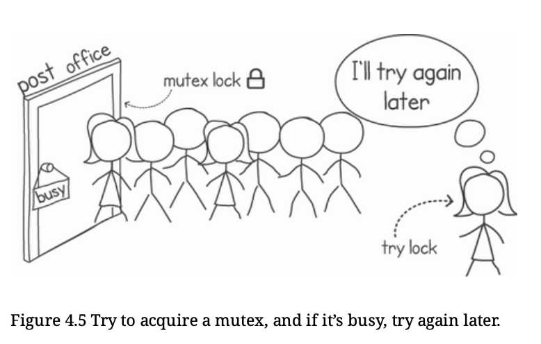

# Synchronization with Mutexes

- Mutex, short for mutual exclusion, is a form of concurrency control with the purpose of preventing race conditions. 
- A mutex allows only one execution (such as a goroutine or a kernel-level thread) to enter a critical section. If two executions request access to the mutex at the same time, the semantics of the mutex guarantee that only one goroutine will acquire access to the mutex. The other execution will have to wait until the mutex becomes available again.

- In Go, mutex functionality is provided in the sync package, under the type `Mutex`. This type gives us two main operations, Lock() and Unlock(), which we can use to mark the beginning and end of our critical code sections, respectively.

- When we create a new mutex, its initial state is always unlocked.

- The implementation of mutexes involves support from the hardware to provide an atomic test and set operation.
- The hardware guarantees that this test and set operation is atomic—that is, no other execution can access the memory location until the operation completes.

- The important thing to remember is to minimize the amount of time spent holding the mutex lock, while also trying to lower the number of mutex calls. 

- Usually Mutexes are blocking i.e if one go routine has acquired the mutex lock and other also want to do the same then in the code at line mu.Lock() the other one will keep waiting indefinitely(blocked) for the lock to be released.

## Non-Blocking Mutexes

- Mutex type from sync package provides another function called `TryLock()` which, will try to lock the mutex and return *true* if it succeeds but if the lock is already acquired then it will not wait indefinitely and return will a *false* value.

- This allows the use that go-routine instead of getting blocked indefinitely. Hnece improve utilization of resources, but since go-routine creation is far cheaper than thread creation, this functionality is rarely used. Instead we create a new go-routine for another tasks.

