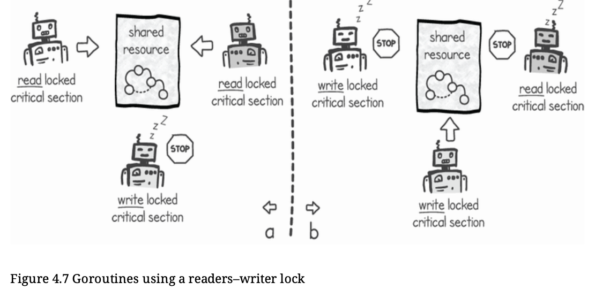

# Reader-Writer Mutex

- Readers-writer mutexes give us a variation on standard mutexes that only block concurrency when we need to update a shared resource. 

- Using readers–writer mutexes, we can improve the performance of read-heavy applications where we are doing a large number of read operations on shared data in comparison with updates.
-  Race conditions only happen if we change the shared state without proper synchronization. If we don’t modify the shared data, there is no risk of race conditions.

- When we just need to read a shared resource without updating it, the readers–writer lock allows multiple concurrent goroutines to execute the read-only critical section part. When we need to update the shared resource, the goroutine executing the write critical section requests the write lock to acquire exclusive access. 



- Go’s sync.RWMutex gives us extra methods to use the reader’s side of the mutex.

```
type RWMutex
//Locks mutex
func (rw *RWMutex) Lock()
//Locks read part of mutex
func (rw *RWMutex) RLock()
//Returns read part locker of mutex
func (rw *RWMutex) RLocker() Locker
//Unlocks read part of mutex
func (rw *RWMutex) RUnlock()
//Tries to lock mutex
func (rw *RWMutex) TryLock() bool
//Tries to lock read part of mutex
func (rw *RWMutex) TryRLock() bool
//Unlock mutex
func (rw *RWMutex) Unlock()
```

- A goroutine executing the critical code section between RLock() and RUnlock(), in our clientHandler() function, blocks a goroutine from acquiring a write lock in our matchRecorder() function. However , it does not block another goroutine from also acquiring a readers’ lock to a critical section. This means that we can have concurrent goroutines executing clientHandler() without any read goroutines blocking each other .

Extra stuff: https://medium.com/golangspec/sync-rwmutex-ca6c6c3208a0

## Interesting stuff:

- Go's implementation of RWMutex is `Write-Prefeered` which can be understood from a comment made in the implementation
```
If a goroutine holds a RWMutex for reading and another goroutine might call Lock, no goroutine should expect to be able to acquire a read lock until the initial read lock is released. In particular , this prohibits recursive read locking. This is to ensure that the lock eventually becomes available; a blocked Lock call excludes new readers from acquiring the lock.
```

- Simply put if we dont do this then `write-starvation` can happen. Imagine 2 read-goroutines exchanging each other continiously and never give chance to the writer.